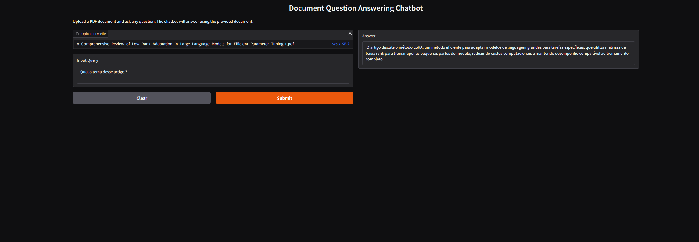

# QA_RAG_for_research_papers

Uso simples: 

-- Escolha seu modelo conversacional finetunado em instruct
-- Escolha seu modelo de embeddings 
-- Inicie o server executando o arquivo QA_bot 
-- Entre nas urls geradas 
-- Coloque o arquivo PDF que quiser
-- Faca sua pergunta sobre o arquivo
-- OBS: Repare que perguntar no mesmo idioma do documento auxilia na precisao da busca vetorial e portanto tera melhores resultados.

